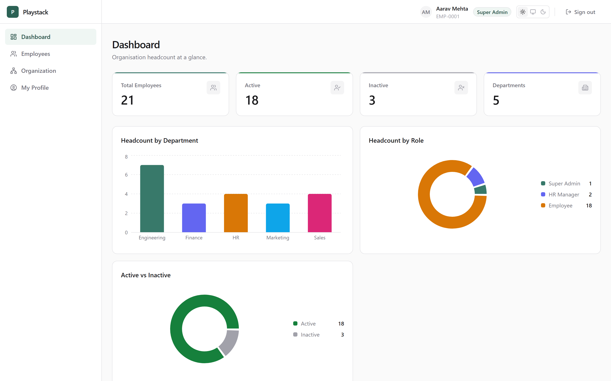
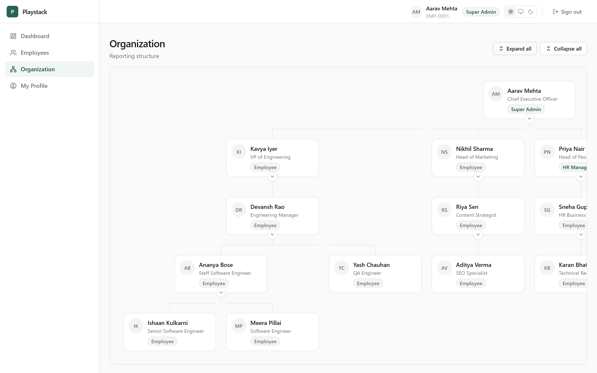
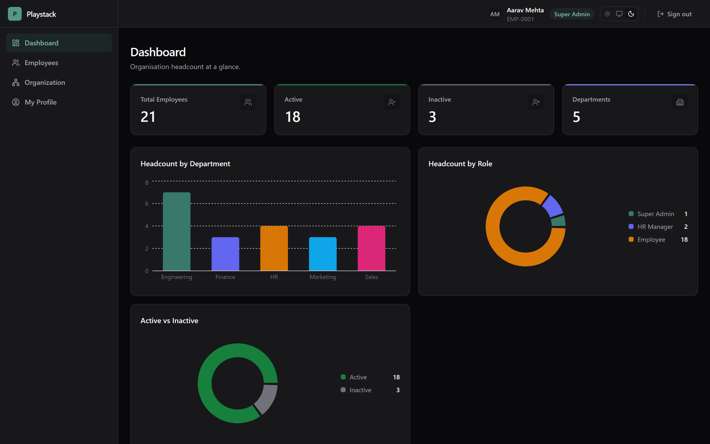
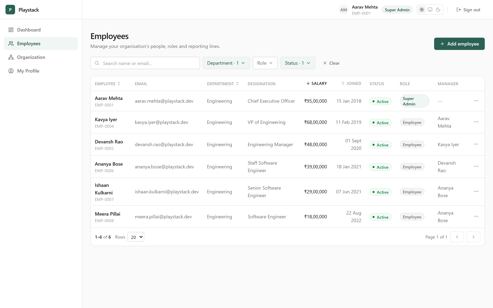
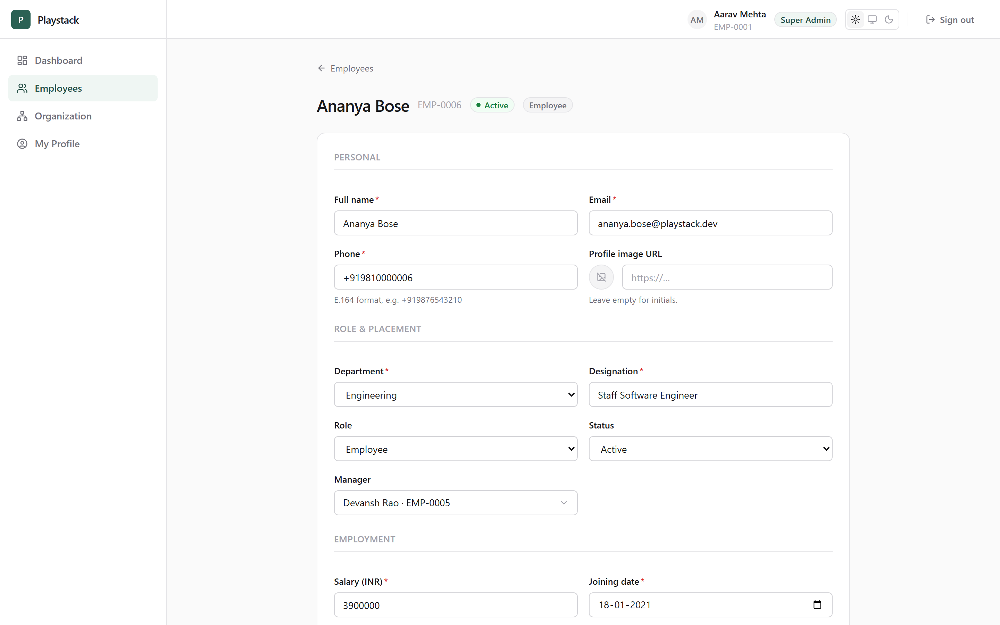
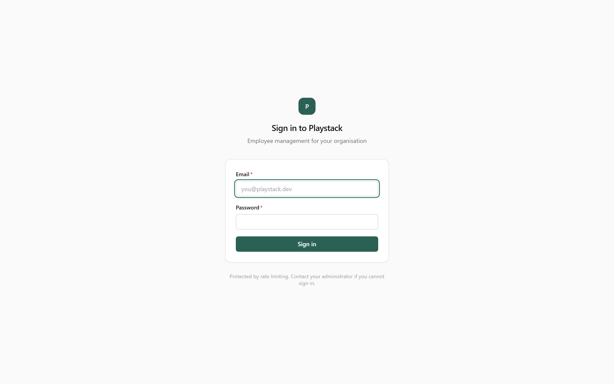
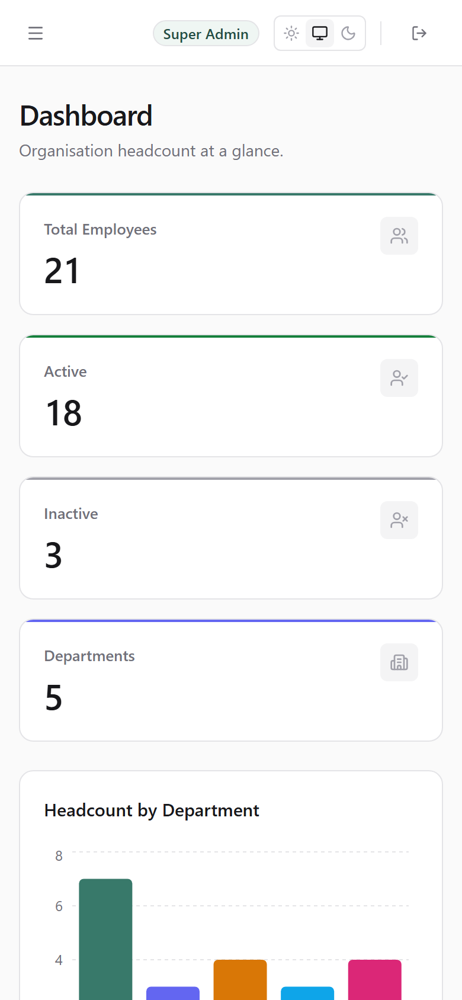

# Playstack — Employee Management System

Role-based employee management with a live org chart: three roles, field-level
permissions enforced from **one shared matrix** that both the Express API and
the Next.js UI import — so a rendered button and an accepting endpoint can
never disagree.



<p align="center">
  
</p>

| More | |
| --- | --- |
| Dark mode |  |
| Employee table (filters + sort live in the URL) |  |
| Edit form (field-level permission gating) |  |
| Login / Mobile |   |

## Demo credentials

No public deployment (see [Deployment](#deployment)); `docker compose up`
brings the full seeded stack live locally in one command. Then sign in at
`http://localhost:3000` as any role:

| Role | Email | Password | Sees |
| --- | --- | --- | --- |
| **Super Admin** | `aarav.mehta@playstack.dev` | `SuperAdmin@123` | Everything: dashboard, employees, org tree, delete/restore, manager + role assignment |
| **HR Manager** | `priya.nair@playstack.dev` | `HrManager@123` | Dashboard + employees; cannot delete, cannot touch Super Admins, cannot reassign managers |
| **Employee** | `ananya.bose@playstack.dev` | `Employee@123` | Own profile + org chart (no salaries but their own) |

## Tech stack

**API** Node.js · Express · TypeScript (strict) · Prisma · PostgreSQL 16 · JWT + bcrypt
**Web** Next.js 15 (App Router) · React 19 · Tailwind · TanStack Query · react-hook-form · recharts · next-themes
**Shared** `@playstack/shared` — permission matrix, Zod schemas, domain types (npm workspaces monorepo)
**Tests** Vitest + Supertest (160 backend tests against a real Postgres)

## Feature checklist

Core requirements:

- [x] Authentication — JWT access + rotating refresh tokens, bcrypt, real logout (server-side revocation)
- [x] Three roles (Super Admin / HR Manager / Employee) with a single permission matrix
- [x] Employee CRUD with soft delete + restore
- [x] Search (name/email), filters (department/role/status, composable), sort, pagination — all server-driven
- [x] Organizational hierarchy — manager assignment, direct/indirect reportees, cycle prevention
- [x] Org tree visualisation — collapsible nodes, connectors, multiple roots, detail drawer
- [x] Dashboard stats — counts + by-department + by-role, aggregated in Postgres
- [x] Field-level permissions — per-role writable-field whitelist, enforced server-side
- [x] Validation shared between frontend forms and backend middleware (one Zod source)

Bonus:

- [x] **Dark mode** — pure CSS-token swap, system-aware, no flash
- [x] **Charts** — recharts, colours from the same theme tokens, sr-only table fallbacks
- [x] **Salary visibility** — read-side field control (Employee sees only their own)
- [x] **Rate limiting** — login, 5/15min per IP+email
- [x] **Manager reassignment from the tree** — with server-side TOCTOU-safe cycle check
- [x] **Docker** — one `docker compose up` for the whole stack
- [x] **160 automated tests**, including RBAC/IDOR/escalation suites

## Quick start

Prereqs: Docker. That's it for the full-stack path.

```bash
git clone https://github.com/asitgiri1234/playstack.git
cd playstack
cp .env.example .env    # then replace every CHANGE_ME (see below)
docker compose up -d --build
```

First build takes a few minutes; after that the stack is live:

- Web → `http://localhost:3000` (log in with the table above)
- API → `http://localhost:4000` (`/health`)
- The API container applies migrations and seeds the demo org automatically
  (seeding is skipped if the database already has data, so restarts never wipe it).

Filling `.env`: set `POSTGRES_PASSWORD` and `PGADMIN_PASSWORD` to anything
local, and generate the two JWT secrets (`openssl rand -base64 48`, twice —
they must differ). Keep `DATABASE_URL` in sync with the `POSTGRES_*` values.

<details>
<summary><b>Dev loop instead (DB in Docker, apps with hot reload)</b></summary>

```bash
npm install
cp .env.example .env      # fill CHANGE_ME values as above
npm run db:up             # postgres + pgadmin only
npm run db:migrate        # prisma migrate dev
npm run db:seed           # 23-person org; prints the credentials table
npm run dev               # api :4000 + web :3000, watch mode
```

`npm test` runs the backend suite (needs `TEST_DATABASE_URL` — a separate
database, because tests truncate tables). `npm run typecheck` / `npm run lint`
cover the monorepo.

</details>

## Architecture

```
playstack/
├── apps/
│   ├── api/                  Express + TS
│   │   ├── prisma/           schema, migrations, seed (23-person org tree)
│   │   └── src/
│   │       ├── middleware/   authenticate → authorize → sanitizeFields → errorHandler
│   │       ├── services/     business logic + pure permission guards
│   │       ├── routes/       thin handlers (~5 lines each)
│   │       └── __tests__/    160 tests: RBAC, IDOR, escalation, cycles, auth
│   └── web/                  Next.js App Router
│       └── src/              app/, components/, hooks/, lib/ (api client, auth)
├── packages/
│   └── shared/               THE point of the design:
│       ├── permissions.ts    Permission union, ROLE_PERMISSIONS, can(),
│       │                     WRITABLE_FIELDS, canWriteField, canReadField
│       ├── validation.ts     Zod schemas (login, create/update, list query)
│       └── types.ts          Role/Status enums, EmployeeDTO, OrgTreeNode
└── docs/API.md               full endpoint reference
```

**Why the shared package is the design.** Authorization rules exist exactly
once, in `packages/shared`, and are imported by both consumers. The Express
middleware calls `can()` to *enforce*; the React sidebar calls the same `can()`
to decide what to *render*. `sanitizeFields` (API) and the form's disabled
fields (UI) are both `canWriteField()`. The Zod schema that rejects a bad phone
number in the browser is byte-for-byte the schema the API re-parses on every
request. Two consumers, one source of truth — the UI can never promise what the
API refuses, and adding a permission is a one-file change that the type system
routes to every consumer.

The middleware chain answers one question per link: **authenticate** (who are
you — role re-read from the DB, never trusted from the JWT), **authorize** (may
this role do this verb), **sanitizeFields** (may they write these fields on
this target), then state-dependent **guards** (pure functions: last-admin
lockout, self-role-change, self-scope) inside the service. Handlers stay ~5
lines; if a handler ever grows an `if (role === …)`, a rule has escaped the
matrix.

API reference: **[docs/API.md](docs/API.md)** — every endpoint with permission,
shapes, and error codes, cross-checked against the route files.

## Security

Threats considered, and how each is mitigated — all of this is enforced
server-side and covered by the test suite:

**Credentials & sessions**
- Passwords bcrypt-hashed (cost 12). Refresh tokens stored as **SHA-256 hashes**
  — a database dump yields no working session.
- Access token (15 min) lives **in browser memory only**; the refresh token is
  an **httpOnly, SameSite=Strict cookie** scoped to `/api/auth`. One XSS can
  read localStorage; it cannot read an httpOnly cookie — that asymmetry is the
  entire placement decision.
- Refresh tokens **rotate** on every use. Replaying a rotated token means two
  parties hold it → the whole session family is revoked, forcing a password
  login. Logout is a server-side revocation, not a client-side forget.

**Authorization**
- Every request is authorized **server-side**; the frontend's permission checks
  are UX only (they call the same shared matrix, but the API re-decides).
- `authenticate` **re-reads the role from the database per request** — a role
  revoked at 10:00 is dead at 10:00, not when a stale JWT expires.
- **Field-level writes are a whitelist** (`WRITABLE_FIELDS`): an Employee
  PUT-ing `{ salary: 999999 }` or `{ role: "SUPER_ADMIN" }` gets a 403 naming
  the rejected fields — never a silent strip, never a write. A column added to
  the schema is unwritable by everyone until explicitly granted.
- **Read-side control mirrors it**: `salary` is omitted from responses unless
  the actor may see it (all-readers for admins/HR, self only for employees);
  `passwordHash` is structurally unserialisable.

**Privilege-escalation traps**
- Cannot delete or demote the **last Super Admin** (system lockout is
  unrecoverable — nobody left can mint an admin).
- **HR cannot write anything on a Super Admin record** — even `phone`, which
  would otherwise be a account-takeover foothold.
- **Nobody edits their own `role`**, Super Admins included: privilege changes
  require a second admin.
- **IDOR guard**: self-scoped routes compare the URL id to the token subject
  *before* the existence lookup, so 403-vs-404 can't be used to probe which
  uuids exist.

**Hierarchy integrity**
- Manager cycles are refused via a depth-capped **recursive CTE** over the
  descendant set, and the check is **re-run inside a Serializable transaction**
  — two concurrent reassignments cannot jointly create a cycle (TOCTOU race,
  verified empirically in the test suite).

**Abuse & injection**
- Login rate-limited (5 failed / 15 min per **IP+email**); failures return one
  generic message and unknown emails still burn a dummy bcrypt compare, closing
  both the response and the timing side of account enumeration.
- `sortBy` is a **Zod enum whitelist** — column names can't be parameterised,
  so nothing user-supplied is ever interpolated into a query. All values go
  through Prisma's parameterisation.
- Page size clamped at 100; JSON bodies capped at 100 kB; unknown body/query
  keys rejected (`.strict()`), not ignored.
- Prisma/stack errors never reach the client — one audited error envelope.

## Design decisions & trade-offs

| Decision | Why | Traded away |
| --- | --- | --- |
| **Postgres + Prisma** over Mongo | The org chart is relational (self-FK + recursive queries), and salary needs `Decimal(12,2)` — money in floats is a correctness bug, not a style choice | Schema migrations as a workflow cost |
| **Refresh-token table** despite "stateless" JWT | Revocation must be a database write or logout is a client-side fiction; rotation + reuse detection need server state | One indexed lookup per refresh |
| **Fresh role lookup per request** | Immediate revocation beats trusting a 15-min-stale claim | One PK lookup per request |
| **Recursive CTE** for descendants | One query, and a **depth cap** means pre-poisoned data degrades to a truncated result instead of an infinite loop — an app-side parent-walk does the opposite | Raw SQL in exactly one file, parameterised |
| **Soft delete + report re-parenting** (transactional) | Salary history is audit evidence; deleting a manager must not orphan a subtree | "Deleted" rows still occupy unique email/code space |
| **Shared package** for matrix + schemas | See Architecture — one source of truth, two consumers | Build step ordering (`build:shared` first) |
| **employeeCode ≠ id** | Human-facing codes get reformatted; foreign keys must not care | A uniqueness check + sequence logic |
| **URL-as-state** for table filters | Filtered views are shareable and survive refresh; no client-side filtering of a stale array | More careful param plumbing |

**Considered, deliberately out of scope** (judgment, not omission):
sequence-backed employee codes (current max+retry approach is correct under
contention but a Postgres sequence is cleaner — needs a migration); manager
names embedded in the list response (the UI joins them from a capped directory
lookup — past ~100 employees the right fix is a Prisma relation include
server-side); subtree-scoped reads for managers ("a manager may see their own
reports' records") — the permission model supports adding it as a new
permission + guard without restructuring.

## Testing

```bash
npm test        # 160 tests, ~35s
```

Vitest + Supertest against a **real Postgres** (`TEST_DATABASE_URL`, separate
database — tests truncate between cases; the config refuses to run against a
non-`playstack_test` database). Pure unit tests for the permission guards and
serializer; integration tests drive real HTTP through the real middleware chain.

Coverage that matters: every RBAC denial in the matrix, IDOR probes, field
escalation attempts (`salary`, `role`, unknown keys), token rotation + reuse
revocation, stale-JWT-after-demotion, last-admin lockout, duplicate email
races, cycle prevention including forced-interleave concurrency, salary
visibility per actor, pagination/filter/sort correctness. Several controls were
**mutation-tested** during development (delete the control, confirm the suite
fails) — the query-count and TOCTOU tests exist specifically because their
first versions passed vacuously.

## Deployment

**No public deployment for this submission** — the tested, guaranteed path is
`docker compose up` (above), which was verified from a clean clone. For a real
deployment:

**Single Docker host (simplest, what the compose file already does)**
The api image (multi-stage, non-root, prod-deps-only) applies migrations on
boot; the web image is a Next.js standalone build. Point DNS at the host, put a
TLS proxy (Caddy/Traefik) in front of ports 3000/4000, done.

**Split hosting (Vercel web + Railway/Render api+Postgres)**
1. Provision Postgres; set `DATABASE_URL`.
2. Deploy the api (build: `npm ci && npm run build:shared && npx prisma generate --schema apps/api/prisma/schema.prisma && npm run build -w @playstack/api`; start: `npx prisma migrate deploy --schema apps/api/prisma/schema.prisma && node apps/api/dist/src/server.js`).
3. Deploy the web on Vercel (root `apps/web`, build runs `build:shared` first), with `NEXT_PUBLIC_API_URL` pointing at the api.
4. **Cookie caveat, by design**: the refresh cookie is `SameSite=Strict`, which
   requires web and api to be **same-site** (e.g. `app.example.com` +
   `api.example.com`). On unrelated domains (`*.vercel.app` + `*.railway.app`)
   the browser will not send it and sessions won't survive refresh — that
   strictness is deliberate CSRF posture, so deploy same-site rather than
   weakening it to `None`.

Production env checklist:

| Var | Note |
| --- | --- |
| `DATABASE_URL` | managed Postgres, TLS |
| `JWT_SECRET`, `JWT_REFRESH_SECRET` | 48+ random bytes, **different values** (API refuses to boot otherwise) |
| `CORS_ORIGIN` | the exact frontend origin — never `*` (the API sends credentials) |
| `NODE_ENV=production` | flips the refresh cookie to `Secure` (HTTPS-only) automatically |
| `NEXT_PUBLIC_API_URL` | public API URL — baked into the browser bundle at build time |
| `BCRYPT_ROUNDS` | ≥ 10 enforced outside tests |

## Known limitations / what I'd do next

- **No public demo URL** — the compose path is the demo. Deploying the split
  path above is mechanical but needs a domain to satisfy the same-site cookie.
- **Employee-code allocation** uses read-max + bounded retry; a Postgres
  sequence would remove the race entirely (migration required).
- **Manager column** in the list view resolves names via a capped directory
  fetch (100) — fine at demo scale, should become a server-side relation
  include before it isn't.
- **No audit log.** Soft deletes preserve rows, but "who changed what when" is
  a table + middleware hook away and the natural next feature for an HR system.
- **No password reset / email flows** — out of scope, and the temp-password
  handoff on create covers onboarding for the demo.
- **Frontend has no automated tests**; it was verified by scripted browser
  runs (Playwright) across all three roles and both themes during development.
  The 160 backend tests carry the security guarantees.
